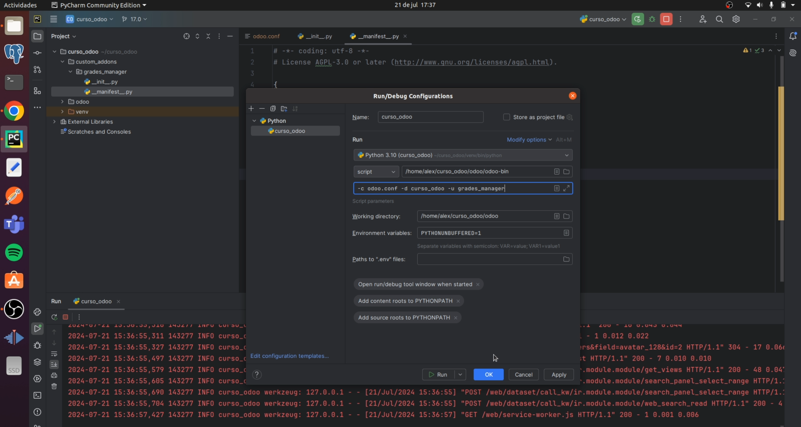
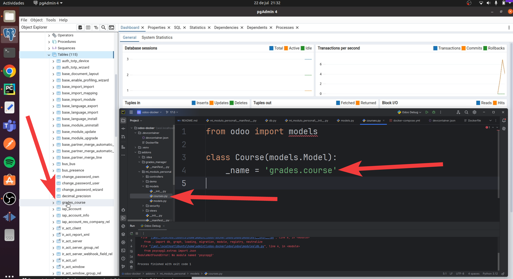

 <a id="0"></a>
# Table of content
- [1. General](#1)
- [2. Docker commands](#2)
- [3. Full Backup Script for Odoo Docker Environment](#3)
- [4. Restore Script for Odoo Docker Backup](#4)

 <a id="1.1"></a>
# 1. General [🡅](#0)

## File __init__.py
import libraries, classes

## Application
allow your app appears on filter application on file **__manifest__.py**

```'application': True,```

## Module auto update

(Section 4.14)

## models folder
logic algorithm of your module

## Create Scaffold or Module Structure Demo
```
docker exec -it odoo-docker-web-1 python3 odoo-bin scaffold mi_modulo /mnt/extra-addons
```
## Module create database table


## Permission on WSL2 ubuntu:
```
ls -ld /home/admin1/odoo-docker/addons/mi_modulo_personal/models
sudo chown -R admin1:admin1 /home/admin1/odoo-docker/addons/mi_modulo_personal/models
sudo chmod -R 755 /home/admin1/odoo-docker/addons/mi_modulo_personal/models
```
if you miss this permission you cannot save or create files from windows 11 PyCharm to Docker or WSL2 Ubuntu.

## find folder 
find / -name "odoo-bin" 2>/dev/null

<a id="2"></a>
# 2. Docker commands [🡅](#0)
## Start Docker
Tips: if doesn't work the command, start the container manually from windows Docker Desktop and will work.

```docker exec -it odoo-docker-web-1 bash```

## Docker Restart
```
docker-compose down
docker-compose up -d
```

## Docker check running
docker ps

## Docker version 

## Delete and Clean Docker volumes
docker volume prune

# Models
Nomrmal = models.Model
Abstract = se usan para ser heredados
Transitorios = no se guarda en base de datos, se utilizan para Wizard.

# PgAdmin from windows 11 connect to WSL2 Ubuntu Docker
from WSL get the ip:
```ip addr | grep inet```

output:
```
    inet 172.17.108.98/20 brd 172.17.111.255 scope global eth0
```
here the ip 172.17.108.98

<a id="3"></a>

## 🔁 4.Restore Script for Odoo Docker Backup [🡅](#0)

This script restores your full Odoo environment from backups, including:

- 📦 The PostgreSQL database volume (`odoo-docker_odoo-db-data`)
- 🧩 Odoo data volume (`odoo-docker_odoo-web-data`)
- 🧠 Your custom addons (`./addons`)

---


